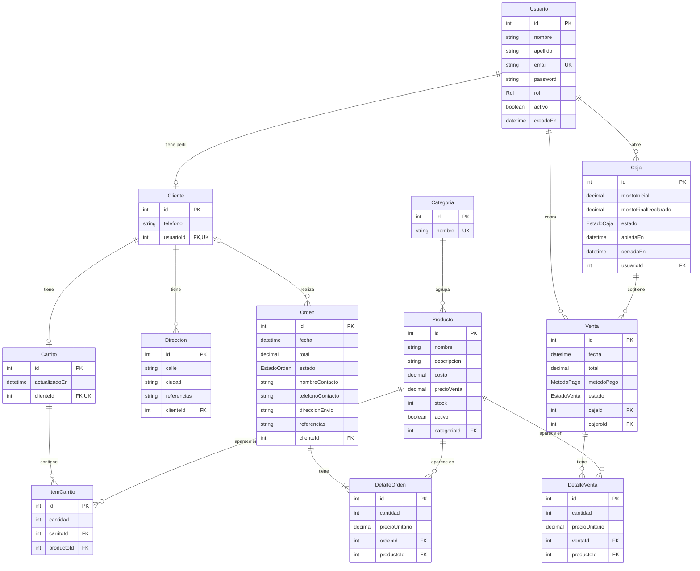

# POS & E-commerce API

API REST híbrida para un comercio que vende en **mostrador (POS)** y en **tienda online**, con un **inventario único sincronizado** entre ambos canales.

Proyecto Final — Desarrollo Web Full Stack (FUNVAL).

## 🔗 Links

| | |
|---|---|
| API en producción | https://pos-ecommerce-api.onrender.com |
| Documentación (Swagger) | https://pos-ecommerce-api.onrender.com/api/docs |

> El plan gratuito de Render "duerme" el servicio tras 15 minutos sin uso: la primera request puede tardar ~50 segundos.

## 👤 Usuarios de prueba

| Rol | Email | Contraseña |
|---|---|---|
| Administrador / Dueño | `admin@pos.com` | `admin123` |
| Cajero | `ana@pos.com` | `cajero123` |
| Cliente web | `lucia@mail.com` | `cliente123` |

En Swagger: `POST /api/auth/login` → copiar el `access_token` → botón **Authorize**.

La base de producción incluye: 4 categorías, 8 productos (uno sin stock), una caja cerrada con ventas del **2026-10-01** (los 3 métodos de pago), una caja abierta para el cajero y órdenes en los 5 estados logísticos.

## 🛠️ Stack

NestJS · TypeScript · Prisma 7 · PostgreSQL · Passport + JWT · class-validator · Swagger · Render · Supabase

## ⚙️ Correr en local

```bash
git clone https://github.com/Natanaelflorentin3/pos-ecommerce-api.git
cd pos-ecommerce-api
npm install
cp .env.example .env      # completar DATABASE_URL y JWT_SECRET
npx prisma migrate dev
npx prisma generate
npx prisma db seed
npm run start:dev
```

Swagger: http://localhost:3000/api/docs

## 📏 Reglas de negocio implementadas

- **Inventario transaccional:** el POS y la tienda descuentan de la misma columna `stock` con una operación atómica (`updateMany` con `stock >= cantidad` dentro de `$transaction`). Si un producto no alcanza, se revierte toda la operación: no hay sobreventa ni inventario a medias.
- **Catálogo público:** no muestra productos con stock 0 ni el costo de adquisición. El `costo` solo lo ve el Administrador.
- **POS:** la venta se abre, se arma un carrito interno y al cobrar se consolida el comprobante y se descuenta el stock. Requiere una caja abierta.
- **Órdenes:** desde la web (checkout) o manuales (ventas por redes sociales, sin cuenta). Máquina de estados `PENDIENTE → PAGADO → EN_CAMINO → ENTREGADO` (o `CANCELADO`, que devuelve el stock).
- **Sin costo de envío:** el total de la orden es solo la suma de los productos. El envío lo paga el cliente al motorista.
- **Caja:** apertura y cierre con conciliación. Efectivo esperado = monto inicial + ventas en efectivo; se compara con lo declarado (cuadra / sobrante / faltante).
- **Roles:** los clientes se registran solos; administradores y cajeros los crea un Administrador.

## 🗂️ Módulos

`auth` · `usuarios` · `categorias` · `productos` · `cajas` · `ventas` · `clientes` · `carrito` · `ordenes` · `prisma`

## 🧩 Diagrama Entidad-Relación



**Enums:** `Rol` (ADMIN, CAJERO, CLIENTE) · `MetodoPago` (EFECTIVO, TARJETA, TRANSFERENCIA_QR) · `EstadoVenta` (ABIERTA, COMPLETADA, CANCELADA) · `EstadoOrden` (PENDIENTE, PAGADO, EN_CAMINO, ENTREGADO, CANCELADO) · `EstadoCaja` (ABIERTA, CERRADA)